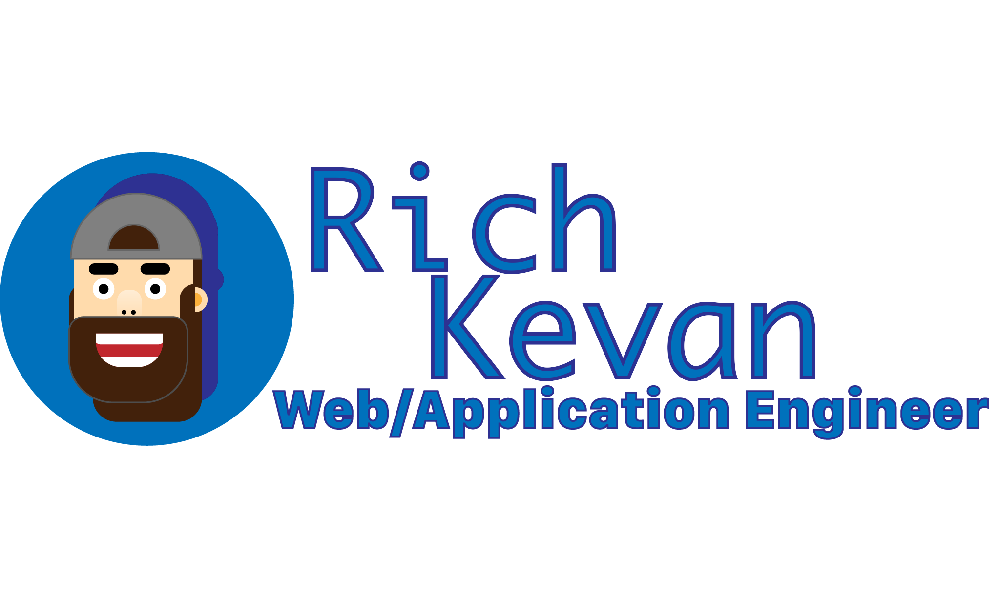
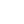

---
> # :information_desk_person: About Me
Thanks for checking out my Github. As you might have guessed I'm Rich and am a application/web engineer and amateur designer. I am from Oregon(GO :duck:) but live in the San Francisco Bay Area :bridge_at_night:  
Some of my hobbies include  
- Video Games :video_game: :joystick:  
- Outdoors :camping: :diving_mask: :flying_disc: :climbing_man: :rowing_man:  
- Games :black_joker: :chess_pawn: :game_die: :jigsaw:
- Fitness :weight_lifting_man: :lotus_position_man: :running_man:

I share my time and my passions with my fiance and 2 daughters :family_man_woman_girl_girl:

> # :books: My Languages & Libraries
### Frontend
| HTML5 | CSS3 | Javascript | React | Redux | Gatsby | Angular |
|---|---|---|---|---|---|---|
|||||| | |

### Backend
| Node.JS | Express.JS | Next.js | Python | Django |
|---|---|---|---|---|
|   |   |   |  |   |  

### Database
| SQL | SQLite | PostgreSQL | Mongo |
|---|---|---|---|
|||||

> # Tools & Applications
### Dev Tools
|VS Code|Jetbrains|Web Storm|Pycharm|Github|Digital Ocean|
|---|---|---|---|---|---|
|||||||

### Learning
|(:fire:)freecodecamp|Codewars|Udemy|HumbleBundle|
|---|---|---|---|
|||||

### Setup
|Brand|Equipment|
|:---|:---|
|| [2021 M1 Mac Mini 16gb ram MacOS Monterey](#) |
|| [CHG49 49" Ultrawide](#)  |
|| [Dream Machine, USW Lite 16 POE, USW Flex, (3)USW Flex Lite](#) |

> # :newspaper: Follow Me

