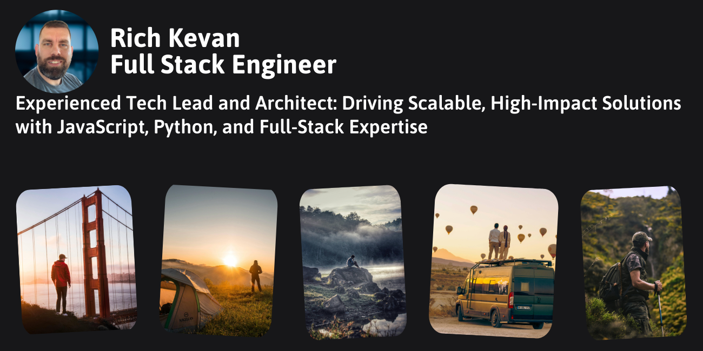

![Static Badge](https://img.shields.io/badge/_Website-black.svg?style=for-the-badge&logo=data:image/svg%2bxml;base64,PHN2ZyBhcmlhLWhpZGRlbj0idHJ1ZSIgZm9jdXNhYmxlPSJmYWxzZSIgZGF0YS1wcmVmaXg9ImZhcyIgaWQ9ImVhcnRoLWFtZXJpY2FzIiBjbGFzcz0ic3ZnLWlubGluZS0tZmEgZmEtZWFydGgtYW1lcmljYXMiIHJvbGU9ImltZyIgeG1sbnM9Imh0dHA6Ly93d3cudzMub3JnLzIwMDAvc3ZnIiB2aWV3Qm94PSIwIDAgNTEyIDUxMiI+PHBhdGggZmlsbD0iI2ZmZiIgc3Ryb2tlPSIjMDAwIiBkPSJNNTEyIDI1NkM1MTIgMzk3LjQgMzk3LjQgNTEyIDI1NiA1MTJDMTE0LjYgNTEyIDAgMzk3LjQgMCAyNTZDMCAxMTQuNiAxMTQuNiAwIDI1NiAwQzM5Ny40IDAgNTEyIDExNC42IDUxMiAyNTZ6TTU3LjcxIDE5Mi4xTDY3LjA3IDIwOS40Qzc1LjM2IDIyMy45IDg4Ljk5IDIzNC42IDEwNS4xIDIzOS4yTDE2Mi4xIDI1NS43QzE4MC4yIDI2MC42IDE5MiAyNzYuMyAxOTIgMjk0LjJWMzM0LjFDMTkyIDM0NS4xIDE5OC4yIDM1NS4xIDIwOCAzNTkuMUMyMTcuOCAzNjQuOSAyMjQgMzc0LjkgMjI0IDM4NS45VjQyNC45QzIyNCA0NDAuNSAyMzguOSA0NTEuNyAyNTMuOSA0NDcuNEMyNzAuMSA0NDIuOCAyODIuNSA0MjkuMSAyODYuNiA0MTMuN0wyODkuNCA0MDIuNUMyOTMuNiAzODUuNiAzMDQuNiAzNzEuMSAzMTkuNyAzNjIuNEwzMjcuOCAzNTcuOEMzNDIuOCAzNDkuMyAzNTIgMzMzLjQgMzUyIDMxNi4xVjMwNy45QzM1MiAyOTUuMSAzNDYuOSAyODIuOSAzMzcuOSAyNzMuOUwzMzQuMSAyNzAuMUMzMjUuMSAyNjEuMSAzMTIuOCAyNTUuMSAzMDAuMSAyNTUuMUgyNTYuMUMyNDUuOSAyNTUuMSAyMzQuOSAyNTMuMSAyMjUuMiAyNDcuNkwxOTAuNyAyMjcuOEMxODYuNCAyMjUuNCAxODMuMSAyMjEuNCAxODEuNiAyMTYuN0MxNzguNCAyMDcuMSAxODIuNyAxOTYuNyAxOTEuNyAxOTIuMUwxOTcuNyAxODkuMkMyMDQuMyAxODUuOSAyMTEuOSAxODUuMyAyMTguMSAxODcuN0wyNDIuMiAxOTUuNEMyNTAuMyAxOTguMSAyNTkuMyAxOTUgMjY0LjEgMTg3LjlDMjY4LjggMTgwLjggMjY4LjMgMTcxLjUgMjYyLjkgMTY1TDI0OS4zIDE0OC44QzIzOS4zIDEzNi44IDIzOS40IDExOS4zIDI0OS42IDEwNy41TDI2NS4zIDg5LjEyQzI3NC4xIDc4Ljg1IDI3NS41IDY0LjE2IDI2OC44IDUyLjQyTDI2Ni40IDQ4LjI2QzI2Mi4xIDQ4LjA5IDI1OS41IDQ4IDI1NiA0OEMxNjMuMSA0OCA4NC40IDEwOC45IDU3LjcxIDE5Mi4xTDU3LjcxIDE5Mi4xek00MzcuNiAxNTQuNUw0MTIgMTY0LjhDMzk2LjMgMTcxLjEgMzg4LjIgMTg4LjUgMzkzLjUgMjA0LjZMNDEwLjQgMjU1LjNDNDEzLjkgMjY1LjcgNDIyLjQgMjczLjYgNDMzIDI3Ni4zTDQ2Mi4yIDI4My41QzQ2My40IDI3NC41IDQ2NCAyNjUuMyA0NjQgMjU2QzQ2NCAyMTkuMiA0NTQuNCAxODQuNiA0MzcuNiAxNTQuNUg0MzcuNnoiPjwvcGF0aD48L3N2Zz4=&logoColor=white&link=https%3A%2F%2Frichkevan.com)

## Summary

A highly experienced full stack engineer, with 5 years of experience in software engineering with javascript, typescript, react python, and django. I led the efforts in creating the SSO process across multiple applications, directly improving the user experience for 50,000 active users. Designed, architected, and delivered ground up refactor of key software components reducing downtime by 70% and wait times by over 50%.

## Skills

| Javascript Typescript React Node Restful APIs | Python Django SQL/NoSQL Database API Design Okta/IAM | Collaboration Communication Problem Solving Adaptability Curiosity  |
|---|---|---|

## Work Experience

### Code Platoon
__Technical Lead__
* Led a team of 5 developers, optimizing workflows by 30% through structured code reviews, quality assurance practices, and
collaborative mentorship.
* Implemented Test Driven Development while adding detailed documentation, resulting in a reduction in software defects and
improved maintainability.
* Directed a major version upgrade, leading to perfomance optimizations and security enhancements through simplified forms
and async improvements

### Instant Teams
__Full Stack Engineer__
* Led development of an internal Auth0/SSO saving the company over 1.5 million annually in support an user lifecycle costs.
* Enhanced security by reducing password fatigue, adding Multi-factor Authentication and detailed user activity logs to the
internal Auth0/SSO.
* Improved user experience by enabling passwordless and social login while centralizing user management and automating
lifecycle management

### Bayside
__Application Engineer__
* Led the ground up rebuild of asset management software to reduce application errors and bugs, increasing uptime by 70% and
user adoption by 90%.
* Optimized customer experience with decreased wait times by providing support and creating comprehensive documentation
and training for asset management software.
* Oversaw integration and deployment of 3rd party software to replace outdated legacy systems, leading to 20k average annual
savings.

### Bayside
__Full Stack Engineer__
* Led the development and deployment of an application for viewing live streams and past content, creating a 15% increase in engagement with targeted demographics.
* Built a streaming application that enabled media delivery to multiple destinations, leading to wide availability of internally produced content.
and training for asset management software.
* Headed the integration of wordpress, enabling seamless content updates reducing the number of staff and time needed to approve and post content updates.

## Education

- ### Okta Certified Administrator
  - __Okta__

- ### Okta Certified Professional
  - __Okta__

- ### Certificate Full Stack Development
  - __Southern New Hampshire University__